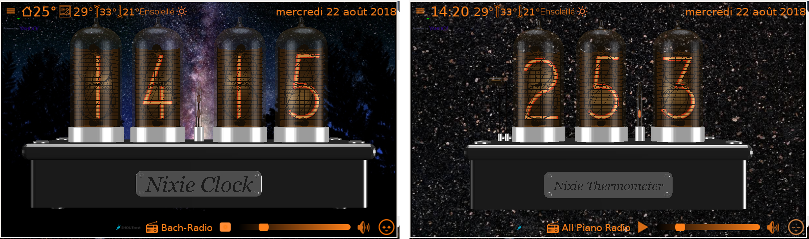

****************************************************************************************************************
                                                     Information
Unfortunatlly the weather part of this application fails. It was based on http://query.yahooapis.com.
It is a problem with the Yahoo servers. Yahoo Developer Network said in a tweet :

**"On Jan. 3, 2019, YQL service at http://query.yahooapis.com will be retired. YQL based services that use http://query.yahooapis.com, 
including users of http://datatables.org, will no longer operate."**

I will look for a replacement.
****************************************************************************************************************

Like me, you like the look of old digital clocks but you find that they are often expensive,
have only very few features, have a limited life and never on time, so you will love this clock.

Nixie is my first digital vintage and virtual 3D clock.

It allows to have a Nixie tube clock without Nixie tubes. Its main advantages are:
- Always on time in summer and winter.
- Very cheap.
- Nixie tubes do not age.
- No high voltage.

But that's not all. It allows in other:
- Display the indoor temperature (currently valid on Raspberry PI3).
- The weather forecast to 10 days.
- The date.
- To listen to web radios.
- To program alarms.
- Adjust its brightness according to the ambient brightness (currently valid on Raspberry PI3).

She may also:
- A stopwatch with lap time.
- Timers.
- A thermometer.

Finally, his look of Nixie tubes is enhanced by:
- An uniform background color.
- An image of your choice.
- A slideshow of your choice.

How does all this work?

All you need is a Windows or Linux computer or Raspberry PI3 under Rasbian Stretch.
Download the installers for each system, and launch the program.
Of course if you have a Rapsberry PI 3 with an official touch screen, the clock is completely autonomous.

Build Nixie needs to install QT5. It has been tested from:
  - Windows "qt-opensource-windows-x86-mingw530-5.8.0.exe" installer download from https://download.qt.io/official_releases/qt/5.8/5.8.0/.
    A 32 bits is built. It runs on Windows 10 32 or 64 bits. 
	
  - Linux "qt-opensource-linux-x64-5.8.0.run" installer downloads from https://download.qt.io/official_releases/qt/5.8/5.8.0/.
    A 64 bits is built. It has been tested on Kubuntu 17.10 and Ubuntu 18.04 under VirtualBox and Ubuntu 18.04 native.
 
   - Raspbian Nixie clock can be built using QT5.7 available in standard packages.
     To build Nixie install QT5.7 and QtCreator on your Raspberry PI3.
      * sudo apt-get install qt5-default
      * sudo apt-get install qtcreator
	  
    For me it worked but another solution is possible.
      * sudo apt-get update
      * sudo apt-get upgrade
      * sudo apt-get install qtcreator gcc qtbase5-dev
	
    It has been tested under Raspbian Stretch with desktop on a Raspberry PI3 and using the official 7” screen.
	
To test it, some installers are avalaible at: https://drive.google.com/open?id=1-NYaP9FZ8btiqm2BfRxURVEukjmCO6SI
Please see user-manual.pdf before installing Nixie.

